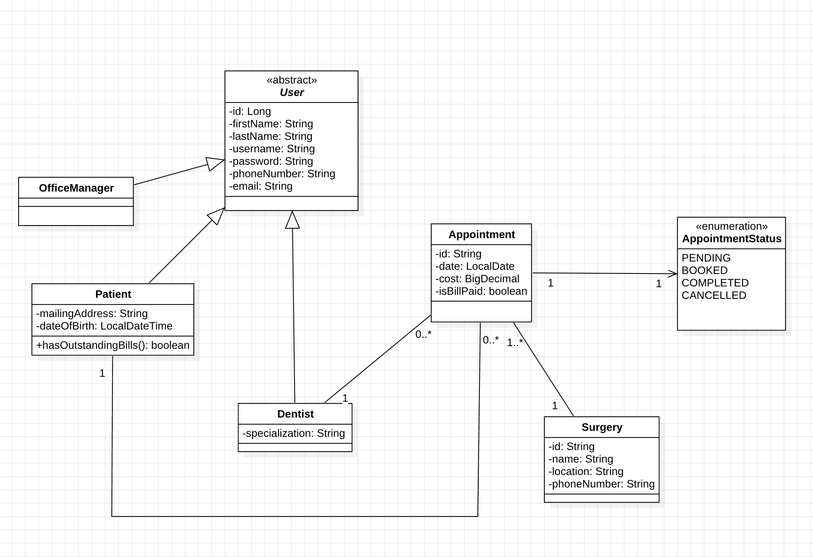

# ADS Web Management System

## 1. Functional Requirements for the system

### 1. User Management

1. Doctors, Patients and OfficeManager should be able to login to the system.

### 2. Appointment Management

1. Patients should be able to book appointments for surgery online through web form and through call.
2. Office Manager should be able to confirm booking for appointment to a given location of surgery.
3. System should only allow up to 5 appointments a week per doctor.
4. A surgery can have many appointments.
5. Office manager should assign a doctor for an appointment based on specialty.

### 3. Bill Management

1. A patient cannot book future appointment if he/she has outstanding bill.

---

## 2. UML Diagram for the ADS Web Management System

<figure>
    
    <figcaption>UML Diagram for ADS Web Management System</figcaption>
</figure>
