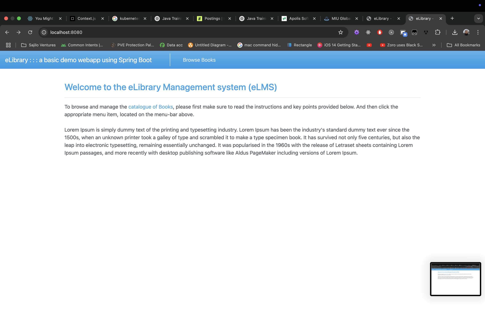
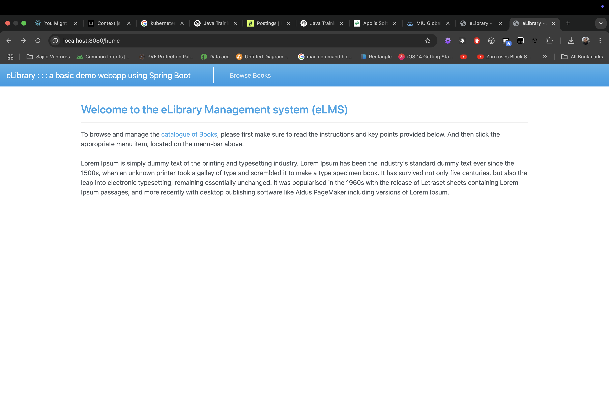
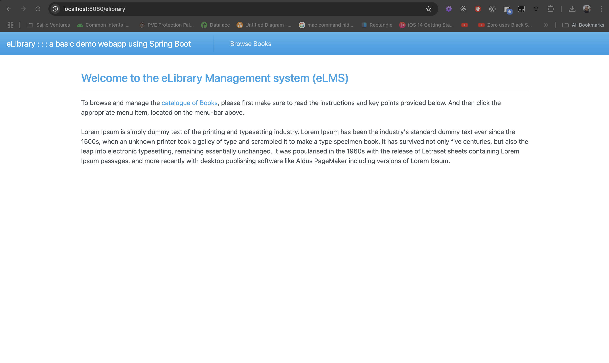
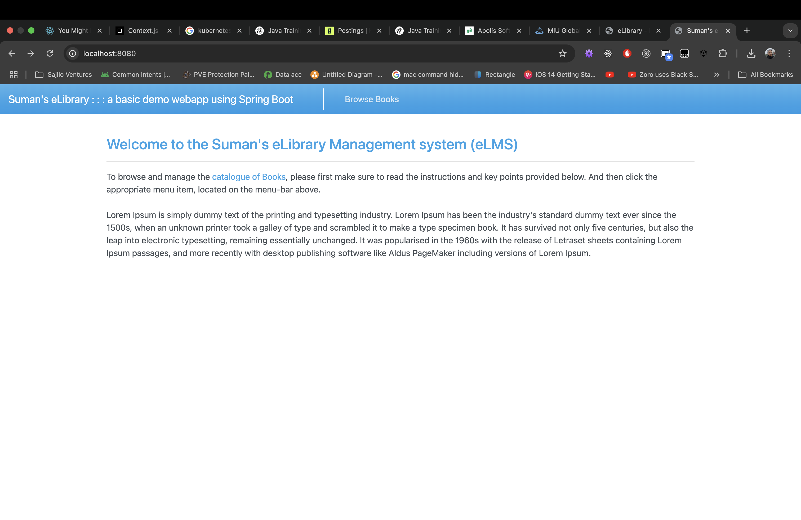

# Lab 3 Solution

# 1. Create Spring app

## 1-a. Screenshots

 
 
 

## 1-b. Screenshots

Changed name of library banner to personal name.

 

# 2. Write short answers to the following questions.

Note: For each question, show it or give an example to support your answer.

**What is Spring?**  
Spring is an open-source framework for Java that helps in building Java enterprise-level applications. It provides features like Dependency Injection, Transaction Management, Aspect Oriented Programming and Spring MVC for web applications.

**What is Spring Boot?** 
Spring Boot is an open-source framework built on top of Spring framework that takes opinionated approach towards developing apps with Spring Framework thus reducing time for configuration and increase productivity.

**What is the relation between Spring platform and Spring Boot?**  

The Spring platform refers to the entire ecosystem of Spring projects. Spring Boot is one of the spring projects that is built on top of Spring framework. It simplifies the time it takes to configure the Spring apps by taking opinionated approach to creating and deploying Spring apps.

**What is the relation between Spring platform and Spring framework?**  

The Spring platform refers to the entire ecosystem of Spring projects. Spring framework is the core Spring framework that provides many features like AOP, Transaction Management, DI and IoC, Spring MVC and so on.

**What is Dependency Injection and how is it done in the Spring platform/framework?** 

Dependency Injection refers to providing the dependency for an entity or resource in stead of creating them. In Spring platform, Dependency Injection is handled by the spring framework through constructor injection, setter injection or field injection.

**What is Inversion of Control (IoC) and how is it related to Spring?** 

Inversion of Control (IoC) refers to the design principle where the framework calls our code instead of us calling the framework. It's the hollywood principle, "Don't call us, we'll call you."

In Spring, we provide our controllers, DAOs, Services, RestControllers, and UserDetailsService and so on and Spring uses them and directs the calls to them based on the requests received.