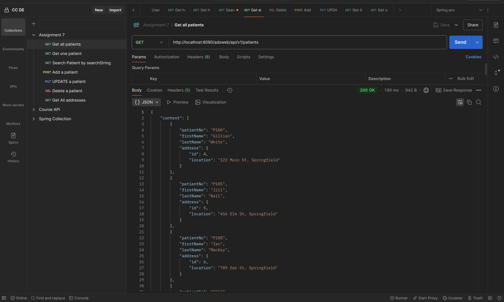
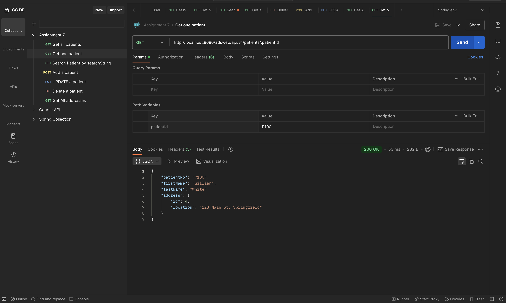
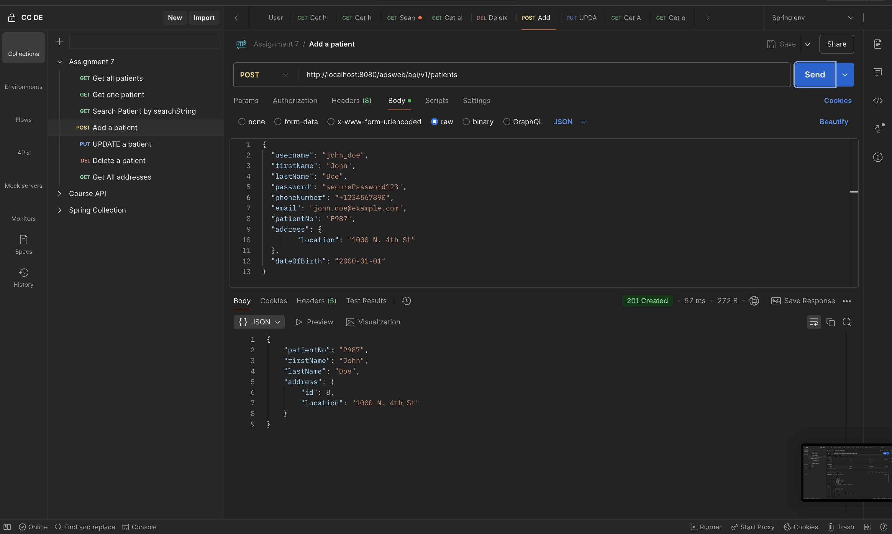
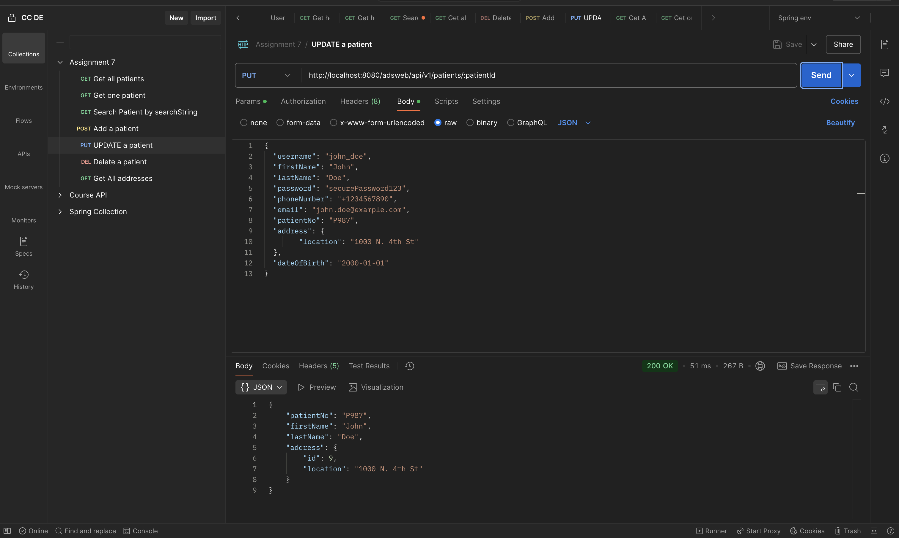
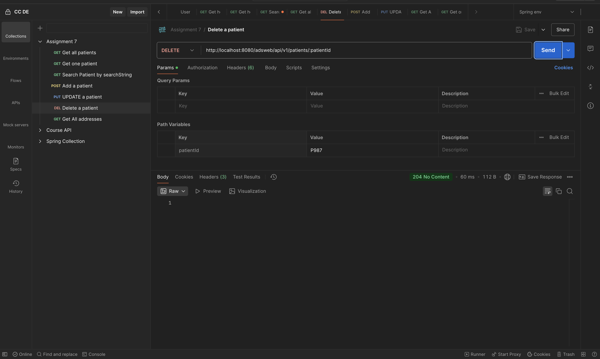
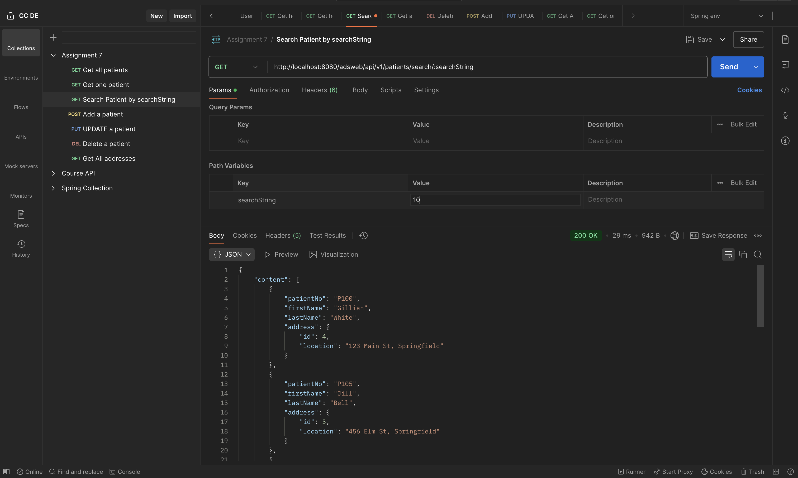
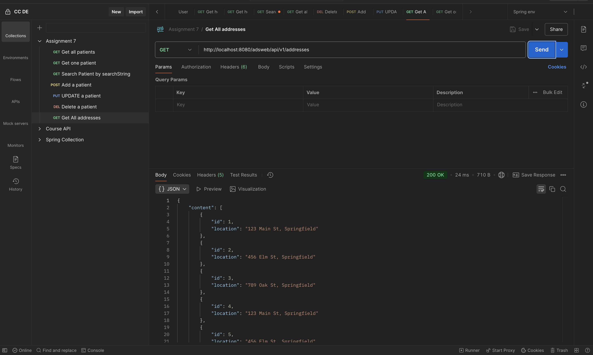

# Assignment 7 Solution

## 1. Get all patients

## 2. Get one patients

## 3. Add a patient

## 4.Update a patient

## 5. Delete a patient

## 6. Search patients by searchString

## 7. Get all addresses

